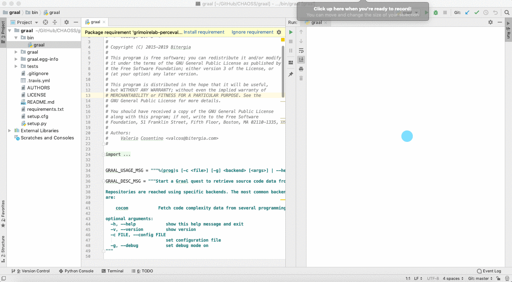

## Microtask #5

In this microtask, we'll try to set up Graal to be executed from PyCharm IDE.

#### Steps

- Firstly download and install [PyCharm IDE](https://www.jetbrains.com/pycharm/)
- Clone [Graal](https://github.com/chaoss/grimoirelab-graal) repository 
- Open the graal project in PyCharm IDE

#### Run/Debug Configuration

1. Select script as `bin/graal`
2. Pass Graal parameters in `Parameters` input tab.
3. Apply & Run the script

**Note:** In this case, i've used Graal's `CoCom` backend .

    

 

- Refer PyCharm [basics](https://www.jetbrains.com/help/pycharm/essentials.html)
- Refer to other commands by passing `--help` in configuration parameter

    <b> This concludes microtask #5 </b>

